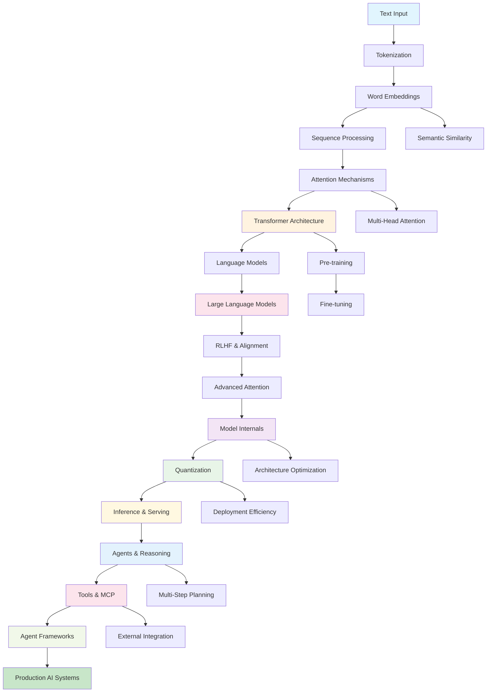

# AI Concept Map: How Everything Connects

## Visual Learning Path

Understanding AI is like building a house - each concept provides the foundation for the next. This concept map shows how fundamental ideas connect and build upon each other throughout your learning journey.

## The Complete AI Practitioner Journey



## Phase-by-Phase Concept Connections

### Phase 1: NLP Foundations 🏗️

#### Core Foundation
```
Text → Tokenization → Vocabulary → Embeddings
```

**Key Relationships**:
- **Tokenization** determines what **Vocabulary** is possible
- **Vocabulary** size affects **Embedding** quality and computational cost
- **Embeddings** convert discrete words into continuous mathematical space

**Why This Matters**: Every AI system starts here. Get this wrong, and everything built on top suffers.

### Phase 2: Transformer Architecture 🧠

#### The Attention Revolution
```
Embeddings → Query/Key/Value → Attention Weights → Contextual Representations
                    ↓
            Multi-Head Attention → Layer Normalization → Feed Forward
```

**Key Relationships**:
- **Embeddings** become **Queries, Keys, and Values** for attention computation
- **Multi-Head Attention** allows parallel processing of different relationship types
- **Layer Normalization** stabilizes training of deep networks
- **Feed Forward** networks process attention outputs

**Why This Matters**: Attention solves the "memory bottleneck" that limited earlier approaches.

### Phase 3: Language Models 📚

#### From Architecture to Intelligence
```
Transformer Layers → Pre-training Objective → Language Understanding
                            ↓
                    Next Token Prediction → Emergent Capabilities
```

**Key Relationships**:
- **Transformer Architecture** provides the computational foundation
- **Pre-training Objectives** (like next token prediction) teach language patterns
- **Scale** (model size + data) leads to **Emergent Capabilities**
- **Transfer Learning** allows adaptation to specific tasks

**Why This Matters**: This is where AI starts to seem "intelligent" - understanding and generating human-like text.

### Phase 4: Large Language Models & Alignment 🎯

#### From Intelligence to Usefulness
```
Pre-trained LLM → Instruction Tuning → Human Preference Learning → Aligned AI
                        ↓                       ↓
                 Helpful Responses      Safe & Truthful Outputs
```

**Key Relationships**:
- **Large Scale** enables **In-Context Learning** and **Few-Shot Capabilities**
- **Instruction Tuning** teaches models to follow human directions
- **RLHF** aligns model outputs with human preferences
- **Prompt Engineering** becomes a key interface for controlling behavior

**Why This Matters**: This transforms raw language understanding into practical, safe AI assistants.

---

## Advanced Phases: From Understanding to Production Mastery

### Phase 5: Advanced Attention 🔍

#### Attention Specialization
```
Basic Attention → Multi-Scale Attention → Sparse Attention → Optimized Attention
                        ↓                    ↓                    ↓
                 Hierarchical Processing  Long Sequences     Efficient Deployment
```

**Key Relationships**:
- **Multi-Scale Attention** enables hierarchical understanding
- **Sparse Attention** makes long sequences tractable
- **Attention Optimization** enables practical deployment

### Phase 6: Model Internals 🏗️

#### Architecture Deep Dive
```
Transformer Basics → Modern Architectures → Position Encoding → Mixture of Experts
                            ↓                      ↓                    ↓
                        Llama/Mistral           RoPE              Scalable Compute
```

**Key Relationships**:
- **Modern Architectures** build on transformer foundations
- **RoPE** solves position encoding limitations
- **MoE** enables efficient scaling

### Phase 7: Quantization ⚡

#### Optimization Pipeline
```
Full Precision Models → Post-Training Quantization → Quantization Formats → Hardware Optimization
                              ↓                           ↓                        ↓
                        GPTQ/AWQ Methods              GGUF/GGML            INT8/INT4 Inference
```

**Key Relationships**:
- **Quantization Methods** reduce model size while preserving quality
- **Specialized Formats** optimize for different hardware
- **Hardware Optimization** enables edge deployment

### Phase 8: Inference & Serving 🚀

#### Production Pipeline
```
Trained Models → Inference Engines → Batching Strategies → Distributed Serving
                      ↓                    ↓                    ↓
                 vLLM/TensorRT         Dynamic Batching    Load Balancing
```

**Key Relationships**:
- **Inference Engines** optimize model execution
- **Batching Strategies** maximize throughput
- **Distributed Serving** enables scalability

### Phase 9: Agents & Reasoning 🤖

#### Intelligent Behavior
```
Language Models → Reasoning Frameworks → Planning Systems → Multi-Agent Coordination
                        ↓                    ↓                    ↓
                  ReAct/CoT            Multi-Step Planning    Agent Collaboration
```

**Key Relationships**:
- **Reasoning Frameworks** add structured thinking
- **Planning Systems** enable complex task decomposition
- **Multi-Agent Systems** coordinate specialized capabilities

### Phase 10: Tools & MCP 🔧

#### External Integration
```
Language Models → Tool Integration → Knowledge Augmentation → Standardized Protocols
                      ↓                    ↓                        ↓
                Function Calling          RAG Systems              MCP
```

**Key Relationships**:
- **Tool Integration** extends model capabilities
- **RAG Systems** combine models with knowledge bases
- **MCP** standardizes tool access protocols

### Phase 11: Agent Frameworks 🏛️

#### Production Ecosystems
```
Individual Components → Framework Integration → Production Applications → Custom Solutions
                            ↓                        ↓                        ↓
                     LangChain/LlamaIndex      Enterprise Systems        Domain-Specific AI
```

**Key Relationships**:
- **Frameworks** provide proven patterns and integrations
- **Production Applications** combine multiple components
- **Custom Solutions** address specialized requirements

---

## Conceptual Dependency Graph

### Fundamental → Intermediate → Advanced

#### Level 1: Mathematical Foundations
- **Vectors and Matrices**: How we represent information mathematically
- **Similarity Metrics**: How we measure relationships between representations
- **Neural Networks**: Basic building blocks of learning systems

#### Level 2: Text Processing Fundamentals
```
Mathematical Foundations
          ↓
    Text → Numbers (Tokenization + Embeddings)
          ↓
    Pattern Recognition (Sequence Models)
```

#### Level 3: Attention and Transformers
```
Text Representations + Pattern Recognition
          ↓
    Focus Mechanisms (Attention)
          ↓
    Parallel Processing (Transformers)
```

#### Level 4: Language Understanding
```
Transformer Architecture
          ↓
    Scale + Data (Pre-training)
          ↓
    Language Models
```

#### Level 5: Practical AI Systems
```
Language Models
          ↓
    Human Feedback (RLHF)
          ↓
    Aligned AI Assistants
```

#### Level 6: Production Optimization
```
Aligned AI Systems
          ↓
    Model Internals Understanding
          ↓
    Quantization & Optimization
```

#### Level 7: Deployment & Serving
```
Optimized Models
          ↓
    Inference Engines & Batching
          ↓
    Production Serving Systems
```

#### Level 8: Intelligent Agents
```
Deployed Models
          ↓
    Reasoning & Planning
          ↓
    Multi-Agent Systems
```

#### Level 9: Ecosystem Integration
```
Agent Systems
          ↓
    Tool Integration & MCP
          ↓
    Production Frameworks
```

## Cross-Cutting Concepts

### Themes That Span Multiple Phases

#### 1. Representation Learning
- **Phase 1**: Static word embeddings capture basic meaning
- **Phase 2**: Attention creates dynamic, context-dependent representations
- **Phase 3**: Multiple transformer layers build hierarchical understanding
- **Phase 4**: Large scale enables abstract concept representation
- **Phase 6**: Model internals reveal how representations are processed
- **Phase 7**: Quantization compresses representations while preserving meaning
- **Phase 9**: Agents learn task-specific representation patterns

#### 2. Scale and Emergence
- **Phase 1**: More data improves embedding quality
- **Phase 2**: Deeper transformers capture more complex patterns
- **Phase 3**: Model size enables transfer learning
- **Phase 4**: Massive scale leads to emergent capabilities
- **Phase 6**: Architecture innovations enable efficient scaling
- **Phase 7**: Quantization democratizes access to large models
- **Phase 8**: Serving optimizations enable real-world scale

#### 3. Context and Memory
- **Phase 1**: N-grams provide limited local context
- **Phase 2**: Attention enables global context within sequences
- **Phase 3**: Pre-training creates implicit knowledge storage
- **Phase 4**: In-context learning acts like temporary memory
- **Phase 5**: Advanced attention handles longer contexts efficiently
- **Phase 9**: Agents maintain state across multi-step interactions
- **Phase 10**: External tools extend context beyond model limitations

#### 4. Human-AI Alignment
- **Phase 1**: Vocabularies must match human language use
- **Phase 2**: Attention patterns should reflect human reasoning
- **Phase 3**: Model outputs should be human-interpretable
- **Phase 4**: AI behavior should align with human values
- **Phase 6**: Model interpretability enables understanding of AI decisions
- **Phase 9**: Agent behavior must be predictable and controllable
- **Phase 11**: Frameworks provide guardrails for safe AI deployment

#### 5. Efficiency and Optimization
- **Phase 5**: Advanced attention reduces computational complexity
- **Phase 6**: Architectural innovations balance capability and efficiency
- **Phase 7**: Quantization enables resource-constrained deployment
- **Phase 8**: Serving optimizations maximize throughput and minimize latency
- **Phase 10**: Tool integration optimizes for task-specific efficiency
- **Phase 11**: Frameworks provide optimized implementations

#### 6. Real-World Integration
- **Phase 8**: Inference systems bridge research and production
- **Phase 9**: Agents enable AI to act in dynamic environments
- **Phase 10**: Tools connect AI to external systems and data
- **Phase 11**: Frameworks enable enterprise-grade AI applications

## Learning Path Connections

### Prerequisite Relationships

#### Must Understand First
```
Tokenization → Embeddings → Attention → Transformers → Language Models → LLMs
```

#### Can Learn in Parallel
- **Embeddings** and **Basic Neural Networks**
- **Multi-Head Attention** and **Layer Normalization**
- **Pre-training** and **Fine-tuning** concepts
- **RLHF** and **Prompt Engineering**

#### Reinforcement Loops
- Understanding **Attention** deepens appreciation of **Embeddings**
- Learning **Language Models** clarifies why **Transformers** work
- Exploring **RLHF** reveals limitations of pure **Pre-training**

### Skill Building Progression

#### Beginner Skills (Phases 1-2)
1. **Vocabulary**: Understanding AI terminology
2. **Pattern Recognition**: Seeing how concepts connect
3. **Basic Intuition**: Mental models for abstract concepts
4. **Tool Usage**: Effective use of visualizations

#### Intermediate Skills (Phases 3-4)
1. **System Thinking**: Understanding how components interact
2. **Trade-off Analysis**: Recognizing design decisions and impacts
3. **Application Mapping**: Connecting concepts to real-world uses
4. **Problem Diagnosis**: Identifying why things might not work

#### Advanced Skills (Phases 5-11)
1. **Research Literacy**: Understanding cutting-edge papers
2. **Implementation**: Building systems from concepts
3. **Optimization**: Improving existing approaches
4. **Innovation**: Creating novel solutions

## Application Connections

### How Concepts Enable Applications

#### Search Engines
```
Tokenization → Query Understanding
Embeddings → Document Matching
Attention → Relevance Ranking
Language Models → Query Expansion
```

#### AI Assistants
```
Tokenization → Input Processing
Embeddings → Context Understanding
Attention → Conversation Tracking
Transformers → Response Generation
RLHF → Helpful, Safe Responses
```

#### Code Assistants
```
Tokenization → Code Parsing
Embeddings → Semantic Understanding
Attention → Cross-Reference Resolution
Language Models → Code Generation
Fine-tuning → Programming Language Adaptation
```

#### Translation Systems
```
Tokenization → Multi-language Processing
Embeddings → Cross-lingual Representations
Attention → Word Alignment
Transformers → Translation Quality
Pre-training → Language Pair Support
```

## Study Strategy Based on Connections

### For Sequential Learners
Follow the main path linearly:
1. Master each phase completely before advancing
2. Build solid foundations in early phases
3. Regularly review how new concepts connect to previous learning
4. Use concept maps to check understanding

### For Network Learners
Explore connections actively:
1. Jump between related concepts freely
2. Build understanding through multiple perspectives
3. Focus on how concepts interact and influence each other
4. Create personal concept maps and connection diagrams

### For Application-Focused Learners
Start with end goals and work backward:
1. Choose an AI application that interests you
2. Trace back to understand required concepts
3. Study foundational concepts with application context
4. Apply learning immediately to practical projects

## Common Connection Points

### Where Students Often Struggle

#### 1. Tokenization → Embeddings
**The Gap**: Understanding how discrete tokens become continuous vectors
**Bridge**: Vector space analogies and similarity demonstrations

#### 2. Embeddings → Attention
**The Gap**: Why static representations need dynamic updates
**Bridge**: Context-dependent meaning examples

#### 3. Attention → Transformers
**The Gap**: How attention scales to complex architectures
**Bridge**: Layer-by-layer transformer walkthroughs

#### 4. Language Models → LLMs
**The Gap**: What happens with massive scale
**Bridge**: Emergence demonstrations and scaling law visualizations

### Strengthening Weak Connections

#### Review Strategies
1. **Backward Tracing**: Start with advanced concepts and trace to foundations
2. **Forward Building**: Start with basics and build up systematically
3. **Lateral Connections**: Find parallels between concepts at same level
4. **Application Testing**: Verify understanding through practical applications

## Interactive Learning Connections

### How Simulations Connect Concepts

#### Word Embeddings Visualization
- **Connects to**: Tokenization (what gets embedded)
- **Prepares for**: Attention (what attends to what)
- **Reinforces**: Mathematical representation principles

#### Attention Mechanism Explorer
- **Builds on**: Embedding representations
- **Connects to**: Transformer architecture
- **Prepares for**: Language model behavior

#### Language Model Playground
- **Integrates**: All previous concepts
- **Demonstrates**: Emergent capabilities from scale
- **Prepares for**: Understanding RLHF necessity

### Cross-Simulation Learning
- Use **Embedding Visualizer** to understand what **Attention** operates on
- Use **Attention Explorer** to see how **Language Models** focus
- Use **Language Model Playground** to appreciate why **RLHF** is needed

## Conclusion: The Interconnected Web of AI

AI concepts form a tightly interconnected web where understanding deepens through seeing connections. Each new concept doesn't just add knowledge—it transforms your understanding of everything you've learned before.

### Key Principles
1. **Foundational Concepts Matter**: Early concepts support everything that follows
2. **Emergence Through Combination**: AI capabilities emerge from combining simple concepts
3. **Scale Changes Everything**: Quantitative changes lead to qualitative breakthroughs
4. **Human Alignment is Crucial**: Technical capabilities must be aligned with human values

### Your Learning Journey
As you progress through the phases, constantly ask:
- "How does this connect to what I learned before?"
- "What does this enable in terms of capabilities?"
- "Where do I see this concept in AI applications I use?"
- "What would happen if this component was missing or broken?"

Remember: Understanding AI isn't about memorizing isolated facts—it's about seeing the beautiful, interconnected system that enables machines to understand and generate human language.

---

*This concept map is your navigation tool through the interconnected world of AI. Use it to check your understanding, find connections you might have missed, and see how everything fits together in the grand tapestry of artificial intelligence.*