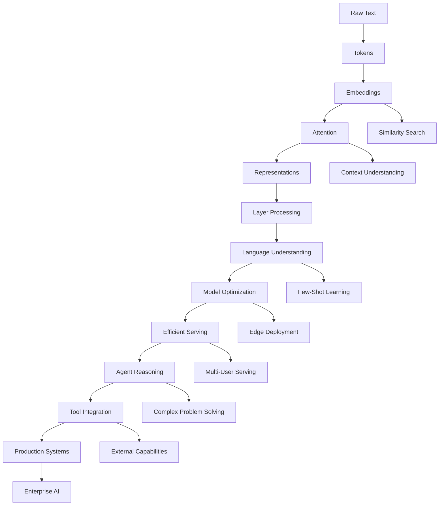

# Concept Bridges: Connecting AI Understanding

## Overview

This guide helps you understand how AI concepts flow and build upon each other. Instead of learning topics in isolation, these "bridges" show you the logical connections that make AI systems work as coherent wholes.

## The Bridge Metaphor

Think of AI concepts like a city connected by bridges:
- **Islands of Knowledge**: Individual concepts (embeddings, attention, etc.)
- **Bridges**: The logical connections that make concepts work together
- **Traffic Flow**: How information and understanding flow between concepts
- **Strong Foundations**: Each bridge must be built on solid conceptual ground

---

## Foundation Bridges (Phases 1-3)

### Bridge 1: Text → Numbers (Tokenization → Embeddings)

#### The Connection
**Problem**: Computers can't directly understand text  
**Solution**: Transform text into mathematical representations

**How the Bridge Works**:
```
Raw Text → Tokenization → Vocabulary → Vector Space → Meaningful Relationships
"hello world" → ["hello", "world"] → [1234, 5678] → [0.2, 0.8, ...] → Similar to "hi earth"
```

**Key Insights**:
- **Tokenization** determines what **can** be represented
- **Embeddings** determine **how well** it's represented
- **Dimension size** balances expressiveness vs. efficiency
- **Training data** shapes the learned relationships

**Real-World Connection**:
Every AI system starts here. When you type into ChatGPT, Google Search, or any AI tool, this transformation happens first.

**Common Misunderstanding**: 
"Embeddings are just lookup tables" → Actually, they're learned representations that capture semantic relationships

**Bridge Strength Test**:
- Can you explain why "king - man + woman ≈ queen" works?
- Do you understand why similar words cluster together?
- Can you predict what happens when vocabulary is too small or too large?

---

### Bridge 2: Static → Dynamic (Embeddings → Attention)

#### The Connection
**Problem**: Word embeddings give words fixed meanings regardless of context  
**Solution**: Attention creates context-dependent representations

**How the Bridge Works**:
```
Static Embeddings → Query/Key/Value → Attention Weights → Dynamic Representations
"bank" [0.3, 0.7, ...] → Q, K, V matrices → Focus weights → "financial bank" vs "river bank"
```

**Key Insights**:
- **Static embeddings** provide the starting material
- **Attention** dynamically combines meanings based on context
- **Multiple heads** capture different types of relationships
- **Self-attention** lets words attend to other words in the same sentence

**Real-World Connection**:
This solves the ambiguity problem that plagued earlier AI systems. "Apple the company" vs "apple the fruit" now get different representations.

**Common Misunderstanding**:
"Attention replaces embeddings" → Actually, attention operates ON embeddings to create better representations

**Bridge Strength Test**:
- Can you explain how "bank" gets different representations in different sentences?
- Do you understand why we need Query, Key, and Value matrices?
- Can you see why multiple attention heads are beneficial?

---

### Bridge 3: Architecture → Intelligence (Transformers → Language Models)

#### The Connection
**Problem**: Individual transformer layers are just computation  
**Solution**: Stacking layers + massive training data creates language understanding

**How the Bridge Works**:
```
Transformer Layers → Deep Architecture → Pre-training → Language Understanding
Layer 1: syntax → Layer 12: semantics → Layer 24: reasoning → Emergent capabilities
```

**Key Insights**:
- **Layer depth** enables hierarchical processing
- **Scale** (parameters + data) leads to emergence
- **Pre-training objectives** shape learned capabilities
- **Transfer learning** allows specialization

**Real-World Connection**:
This bridge explains how GPT, BERT, and Claude work. The architecture enables the intelligence we see in AI assistants.

**Common Misunderstanding**:
"More layers always means better" → Actually, there are diminishing returns and optimization challenges

**Bridge Strength Test**:
- Can you explain what different layers in a transformer learn?
- Do you understand how pre-training creates general language capabilities?
- Can you see why scale leads to emergent abilities?

---

## Advanced Bridges (Phases 6-11)

### Bridge 4: Understanding → Optimization (Model Internals → Quantization)

#### The Connection
**Problem**: Understanding how models work isn't enough for deployment  
**Solution**: Architectural knowledge guides effective optimization strategies

**How the Bridge Works**:
```
Model Architecture → Bottleneck Identification → Targeted Optimization → Production Deployment
RoPE, MoE, SwiGLU → Memory/compute analysis → Quantization strategy → Edge deployment
```

**Key Insights**:
- **Architecture understanding** reveals optimization opportunities
- **Different components** have different quantization sensitivity
- **Hardware characteristics** influence optimization choices
- **Quality trade-offs** depend on architectural design

**Real-World Connection**:
This enables running powerful models on phones, in cars, or on consumer hardware.

**Bridge Strength Test**:
- Can you identify which model components are most quantization-sensitive?
- Do you understand how architectural choices affect optimization strategies?
- Can you match quantization approaches to deployment scenarios?

---

### Bridge 5: Optimization → Serving (Quantization → Inference)

#### The Connection
**Problem**: Optimized models still need efficient serving infrastructure  
**Solution**: Optimization strategies inform serving architecture design

**How the Bridge Works**:
```
Quantized Models → Serving Requirements → Engine Selection → Production Scaling
INT4 model → Low latency needs → vLLM + PagedAttention → Multi-GPU deployment
```

**Key Insights**:
- **Quantization choices** influence serving engine selection
- **Memory optimization** enables better batching strategies
- **Hardware utilization** depends on model format
- **Scaling strategies** build on single-instance optimization

**Real-World Connection**:
This bridge enables ChatGPT to handle millions of users, or edge AI to work offline.

**Bridge Strength Test**:
- Can you match quantization strategies with serving engines?
- Do you understand how memory optimization enables better batching?
- Can you design serving architectures for different scale requirements?

---

### Bridge 6: Serving → Intelligence (Inference → Agents)

#### The Connection
**Problem**: Fast inference isn't enough for complex problem-solving  
**Solution**: Efficient serving enables multi-step reasoning and tool use

**How the Bridge Works**:
```
Optimized Inference → Multi-Step Processing → Agent Reasoning → Complex Problem Solving
Fast generation → Chain of thought → Tool integration → Research assistant
```

**Key Insights**:
- **Low latency** enables interactive reasoning
- **High throughput** supports parallel agent operations
- **Resource efficiency** allows complex multi-agent systems
- **Reliability** is crucial for autonomous operation

**Real-World Connection**:
This enables AI assistants that can browse the web, write code, and solve multi-step problems.

**Bridge Strength Test**:
- Can you explain how serving efficiency enables agent capabilities?
- Do you understand the resource requirements of multi-step reasoning?
- Can you design agent architectures that use serving resources efficiently?

---

### Bridge 7: Agents → Integration (Reasoning → Tools & MCP)

#### The Connection
**Problem**: Smart agents are limited without access to external capabilities  
**Solution**: Standardized tool integration multiplies agent effectiveness

**How the Bridge Works**:
```
Agent Reasoning → Tool Requirements → MCP Integration → Enhanced Capabilities
Planning task → Need web search → Standardized API → Research completion
```

**Key Insights**:
- **Reasoning capabilities** identify tool needs
- **Standardized protocols** enable tool ecosystem
- **Safety mechanisms** prevent harmful tool use
- **Performance optimization** makes tool use practical

**Real-World Connection**:
This enables AI assistants that can actually get things done rather than just talking about them.

**Bridge Strength Test**:
- Can you design tool integration for specific agent capabilities?
- Do you understand how MCP standardization benefits the ecosystem?
- Can you implement safety mechanisms for tool-using agents?

---

### Bridge 8: Integration → Production (Tools → Frameworks)

#### The Connection
**Problem**: Individual components need orchestration for production systems  
**Solution**: Frameworks provide proven patterns and integration layers

**How the Bridge Works**:
```
Individual Components → Framework Integration → Production Patterns → Enterprise Systems
RAG + Agents + Tools → LangChain orchestration → Proven architectures → Scalable deployment
```

**Key Insights**:
- **Framework abstractions** hide complexity while enabling customization
- **Proven patterns** reduce development risk and time
- **Integration layers** handle component compatibility
- **Production features** provide monitoring, scaling, and reliability

**Real-World Connection**:
This enables enterprises to build reliable AI systems without reinventing fundamental patterns.

**Bridge Strength Test**:
- Can you choose appropriate frameworks for different use cases?
- Do you understand when to use frameworks vs. custom solutions?
- Can you extend frameworks for specialized requirements?

---

## Cross-Phase Concept Flows

### The Complete Information Flow



### Skill Building Progression

#### Level 1: Foundation Understanding
**Concepts**: Text processing, vector representations, attention mechanisms
**Skills**: Interpreting visualizations, understanding trade-offs, connecting theory to applications
**Bridge Strength**: Can explain how computers understand language

#### Level 2: Architecture Mastery
**Concepts**: Transformer layers, modern architectures, training dynamics
**Skills**: Analyzing model designs, understanding scaling laws, recognizing architectural innovations
**Bridge Strength**: Can navigate any AI architecture and understand design choices

#### Level 3: Production Engineering
**Concepts**: Optimization, serving, monitoring, scaling
**Skills**: Performance analysis, system design, troubleshooting, cost optimization
**Bridge Strength**: Can deploy and maintain AI systems at scale

#### Level 4: Intelligent Systems
**Concepts**: Agent design, reasoning patterns, tool integration, framework mastery
**Skills**: Building complex AI applications, coordinating multiple components, ensuring reliability
**Bridge Strength**: Can architect complete AI solutions for enterprise needs

---

## Common Bridge Weaknesses

### Where Learners Often Struggle

#### 1. Static to Dynamic Transition (Embeddings → Attention)
**Weak Bridge Symptoms**:
- Thinking attention "replaces" embeddings
- Not understanding why context matters
- Missing the Q/K/V mathematical relationship

**Strengthening Exercises**:
- Compare word meanings in different sentences
- Manually trace attention computation
- Visualize how context changes representations

#### 2. Architecture to Intelligence Gap (Transformers → Language Models)
**Weak Bridge Symptoms**:
- Thinking more layers always means better performance
- Not understanding emergence from scale
- Missing the connection between architecture and capabilities

**Strengthening Exercises**:
- Study layer-by-layer processing in depth
- Explore scaling law relationships
- Compare architectures of different model families

#### 3. Optimization to Deployment (Quantization → Serving)
**Weak Bridge Symptoms**:
- Optimizing in isolation without considering serving needs
- Not matching optimization strategies to deployment scenarios
- Missing performance vs. quality trade-offs

**Strengthening Exercises**:
- Profile end-to-end system performance
- Compare different optimization + serving combinations
- Measure real-world deployment constraints

#### 4. Intelligence to Integration (Agents → Tools)
**Weak Bridge Symptoms**:
- Building agents without considering tool ecosystem
- Not understanding safety and reliability requirements
- Missing standardization benefits

**Strengthening Exercises**:
- Design agent systems with tool requirements in mind
- Implement safety mechanisms for tool use
- Compare standardized vs. custom tool integration

### Bridge Repair Strategies

#### 1. Backward Tracing
Start with a complex concept and trace back to foundational elements:
- How does ChatGPT work? → Trace back to attention → embeddings → tokenization

#### 2. Forward Building
Start with foundations and systematically build understanding:
- Master embeddings → Add attention → Build transformers → Scale to language models

#### 3. Lateral Connections
Find parallels and analogies between concepts at the same level:
- Compare different attention mechanisms
- Contrast various quantization strategies
- Analyze framework trade-offs

#### 4. Application Testing
Validate understanding by applying concepts to real problems:
- Build mini-versions of each component
- Solve problems that require multiple concepts
- Explain complex systems to others

---

## Interactive Bridge Exploration

### Using Simulations to Strengthen Bridges

#### Embeddings → Attention Bridge
1. **Start with Embeddings**: Use the Word Embeddings simulation to understand static representations
2. **Add Context**: Imagine how meanings change in different sentences
3. **Explore Attention**: Use the Transformer simulation to see dynamic representations
4. **Compare**: Switch between simulations to see the transformation

#### Architecture → Optimization Bridge
1. **Understand Internals**: Use Model Internals simulation to see architectural components
2. **Identify Bottlenecks**: Notice memory and computation intensive parts
3. **Apply Optimization**: (When available) Use Quantization Lab to see targeted optimization
4. **Measure Impact**: Compare performance before and after optimization

#### Components → Systems Bridge
1. **Individual Mastery**: Master each simulation independently
2. **Integration Thinking**: Consider how components work together
3. **System Design**: Sketch how you'd combine components for real applications
4. **Framework Mapping**: Identify where frameworks add value

### Building Personal Concept Maps

#### Visual Bridge Building
Create your own concept diagrams showing:
- Information flow between concepts
- Dependencies and prerequisites
- Real-world application connections
- Personal understanding gaps

#### Knowledge Integration Exercises
- **Teaching Practice**: Explain bridges to others
- **Application Design**: Design systems that require multiple concepts
- **Troubleshooting**: Diagnose problems that span multiple concepts
- **Innovation Thinking**: Identify opportunities for new bridges

---

## Mastery Assessment

### Bridge Strength Indicators

#### Strong Bridges (You understand):
- ✅ How each concept enables the next
- ✅ Why specific design choices were made
- ✅ When to apply different techniques
- ✅ How to troubleshoot across concept boundaries
- ✅ Where innovation opportunities exist

#### Weak Bridges (Areas to strengthen):
- ❌ Concepts seem disconnected or arbitrary
- ❌ Can't explain why certain approaches were chosen
- ❌ Struggle to apply knowledge to new problems
- ❌ Difficulty debugging complex systems
- ❌ Missing connections between theory and practice

### Integration Challenges

#### Cross-Bridge Problem Solving
Test your understanding with problems that require multiple concepts:

1. **Design Challenge**: "Build a multilingual search engine"
   - Requires: Embeddings + Attention + Optimization + Serving

2. **Optimization Challenge**: "Deploy a conversational AI on mobile devices"
   - Requires: Architecture understanding + Quantization + Inference optimization

3. **System Challenge**: "Create an AI research assistant"
   - Requires: Agents + Tools + RAG + Framework integration

#### Innovation Opportunities
Strong bridges enable you to identify opportunities for:
- **Architectural improvements**: Better ways to connect components
- **Optimization strategies**: Novel approaches to efficiency
- **Application patterns**: New ways to combine existing concepts
- **Framework evolution**: Next-generation integration approaches

---

This bridge-building approach transforms disconnected knowledge into integrated understanding, enabling you to not just use AI tools, but to build them, optimize them, and innovate with them.